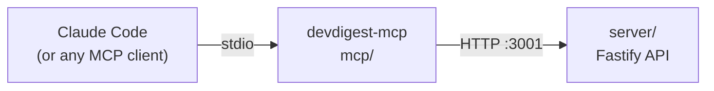

# `@devdigest/mcp` — local stdio MCP server

A local [Model Context Protocol](https://modelcontextprotocol.io) server,
named `devdigest`, that lets Claude Code (or any MCP client) drive the
running DevDigest API with 5 outcome-shaped tools. It is a thin HTTP client:
it never imports server internals or opens a DB connection, so the API stays
the permission boundary.

| Tool | What it does |
|---|---|
| `list_agents` | List DevDigest's reviewer agents — name, description, model, enabled. |
| `run_agent_on_pr` | Start a new review of a PR with one agent, wait for it, and return the verdict and findings. The only write; it spends LLM credits. |
| `get_findings` | Read the verdict and findings of a review that already ran. Starts nothing, costs nothing. |
| `get_conventions` | Get the coding conventions DevDigest extracted from a repo. |
| `get_blast_radius` | Not implemented yet — always returns `status: not_implemented`. |



## Setup

```sh
cd mcp && npm ci
```

(`make test` / `make typecheck` from the repo root run this via the
`mcp/node_modules` file target.) The DevDigest API must be running for any
tool call to succeed — `make dev` from the repo root, first.

Env vars (all optional, all read by `loadConfig`, all default to a loopback
origin per D12):

| Var | Default | What it does |
|---|---|---|
| `DEVDIGEST_API_URL` | `http://127.0.0.1:3001` | Must be a bare loopback origin (`127.0.0.1`, `[::1]` or `localhost`, no userinfo/query/hash/path). Anything else refuses to start. |
| `DEVDIGEST_WEB_URL` | `http://localhost:3000` | Only used to build links in tool output (`web_url`, error hints). |
| `DEVDIGEST_MCP_MAX_WAIT_S` | `900` | How long `run_agent_on_pr` polls before returning a non-error `running` result. Clamped to 30–1800. |

**Nothing writes to stdout.** stdio is the MCP transport — a stray
`console.log` or `process.stdout.write` corrupts every JSON-RPC message on
the wire. Diagnostics go to `console.error` (stderr) only.

## Inspector

Requires **Node ≥ 22.19.0** for the Inspector CLI/UI itself (the server runs
under any Node ≥ 22).

- `make mcp-inspect` opens the web Inspector against `devdigest-mcp`.
- `make mcp-smoke` runs the Inspector CLI (`--cli`) to list the 5 tools and
  call `list_agents` — a fast, deterministic check.

A live `run_agent_on_pr` call takes 1–5 minutes and needs progress
notifications to avoid a client-side timeout, so run it in the **web**
Inspector (`make mcp-inspect`) or in Claude Code — **never** `--cli`, which
has a fixed 60 s timeout and sends no progress token. In the web Inspector,
raise **Server Settings → Request Timeout** if it still times out (it resets
on each progress notification, but the UI default may be too low for a slow
model).

## Using it from Claude Code

Start `claude` from the **repo root** (the launcher shells out to
`git rev-parse --show-toplevel`, so it needs to be inside the checkout). The
project-scoped `devdigest` server from `.mcp.json` shows as "Pending
approval" until you approve it — approve by adding it to
`enabledMcpjsonServers` (e.g. `enabledMcpjsonServers: ["devdigest"]` in your
settings), never with the blanket `enableAllProjectMcpServers`.

**Permissions:** allow the 4 read tools —
`mcp__devdigest__list_agents`, `mcp__devdigest__get_findings`,
`mcp__devdigest__get_conventions`, `mcp__devdigest__get_blast_radius` — and
leave `mcp__devdigest__run_agent_on_pr` on "ask": it is the only write, and
it spends LLM credits. Never commit an allow rule for it.

**Untrusted branch warning:** approval in Claude Code is keyed by server
**name**, not content, so it does not re-prompt when a branch changes what
the server actually runs. After checking out a branch you don't trust, run

```sh
git diff main -- .mcp.json .claude mcp/src
```

before starting `claude`, to catch a PR that rewrote the launcher, the
permission rules, or the server's own source.
